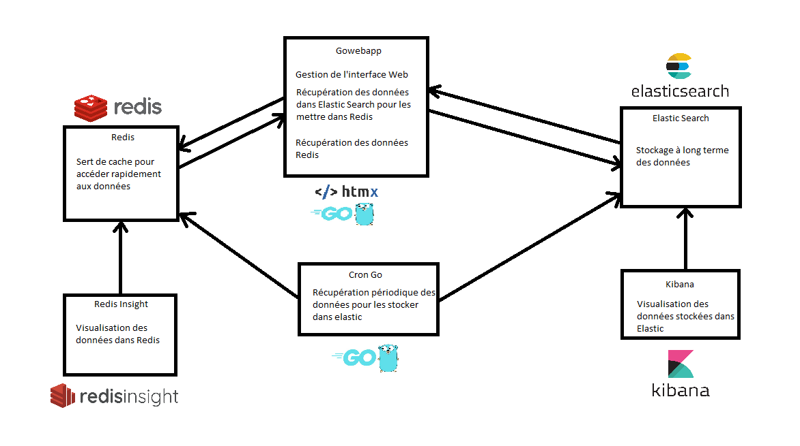

# Rapport projet annuel
Romain Besson - Tuteur : Martin Lekpa

## Résumé du projet
Le but du projet est de créer une solution d'hypervision dans le style de [canopsis](https://www.canopsis.fr/), c'est-à-dire un outil qui regroupe tous les outils de supervision nécessaire
à la mise en place et la gestion d'un système d'information comme par exemple un outil qui récupère et liste les logs de toutes les machine virtuelle et en sort des statistiques, 
ou encore un outil de création de machine virtuelle

## Technologies utilisées
Ce projet devra se baser sur des conteneurs docker pour pouvoir interfacer les différentes technologies. 
Le cœur de l'application sera un programme en GO qui devra faire l'intermédiaire entre les différents composants. 

Pour la partie front-end on utilisera une technologie web du nom de HTMX qui repose sur le principe d'AJAX et qui permet d'utiliser un autre langage que JavaScript pour faire du web. 

Pour la partie données on utilisera un conteneur Redis qui permet un accès rapide aux données grâce au fait qu'elles sont stockées en mémoire 
et pour l'aspect recherche des données on utilisera Elasticsearch, qui est un moteur de recherche dont l'avantage est d'être bien plus rapide 
que des langages de base de données classique comme MySQL.

L'interface web devra permettre aux utilisateurs de se connecter, de créer et supprimer des utilisateurs pour les super admins ainsi que de voir ces utilisateurs pour les admins.

Elle devra aussi mettre en forme les données stocké dans Redis et restitué par Elasticsearch et d'en faire des statistiques.

## Architecture

On peut voir ci-dessus un schéma en pseudo UML qui permet de visualer les différents conteneurs qui compose l'application.

On peut y voir 2 conteneur qui sont Kibana et Redis Insight qui ne servent qu'au développement pour visualiser et interagir avec les données de leur conteneur associé. 

## Méthodologie de travail
Plusieurs rendez-vous régulier ont été fixés de manière périodique environ une fois par mois. 
Une méthode de travail qui aurait pu être mise en place pour améliorer la qualité et la rapidité de développement et le TDD (Test Driven Devlopment) qui est une méthode qui consiste à écrire les tests avant d'écrire le code d'un composant ce qui permet d'être sûr que le composant répond aux attentes fixées au préalable.